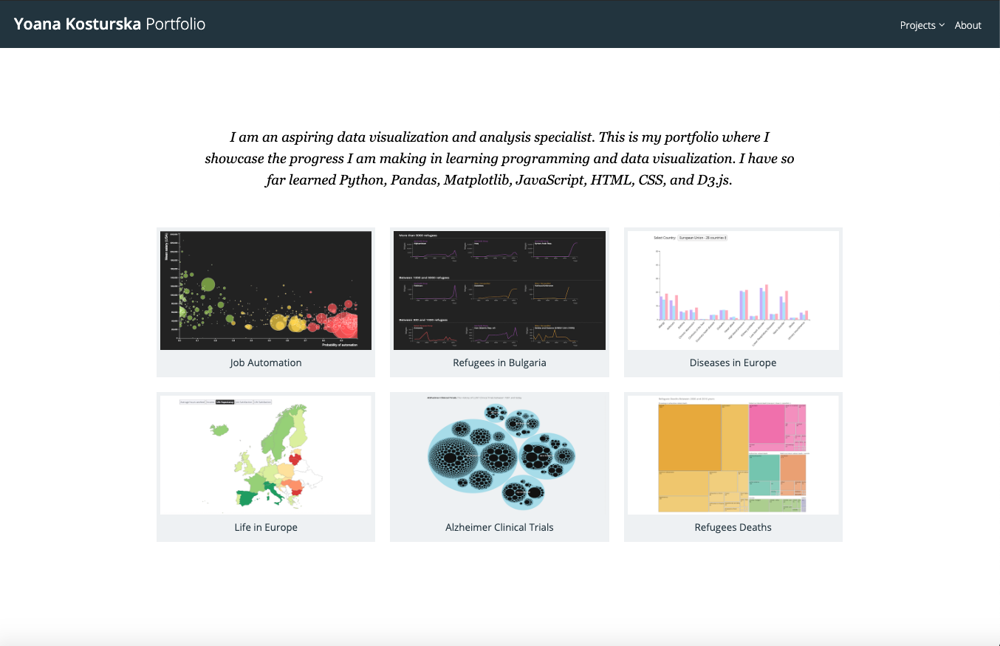

**Link to my portfolio**:
[https://yoanako.github.io/index.html](https://yoanako.github.io/index.html)

This repository contains six projects that I developed in JavaScript, D3.js, HTML, CSS and jQuery, since I started learning to code in the beginning of the year. You can see them live on the link above or navigate to the projects folder where you can see the code and jupyter notebook analysis in Python, Pandas and Matplotlib for each of the projects. 

